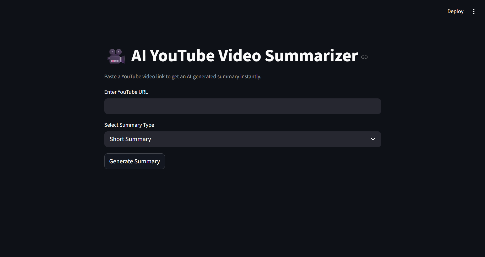
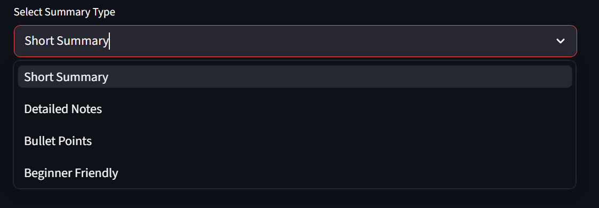
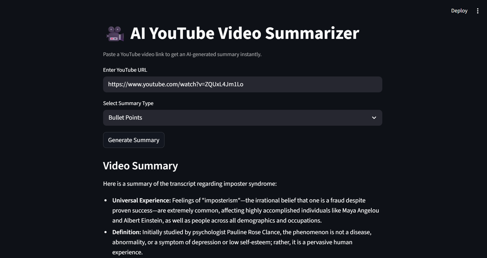
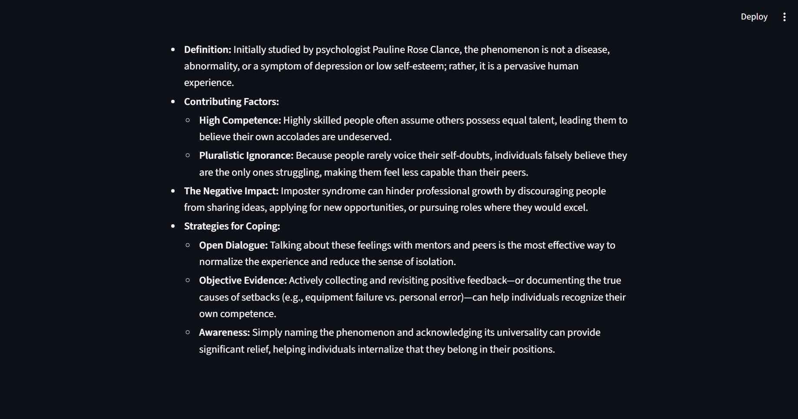
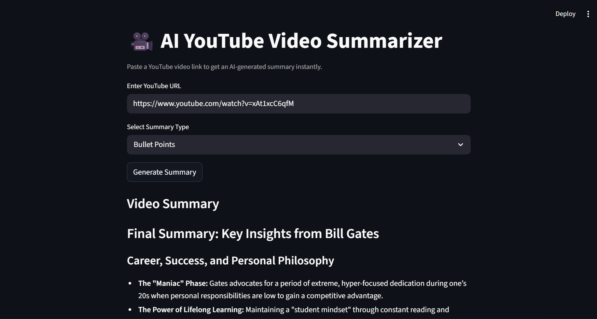
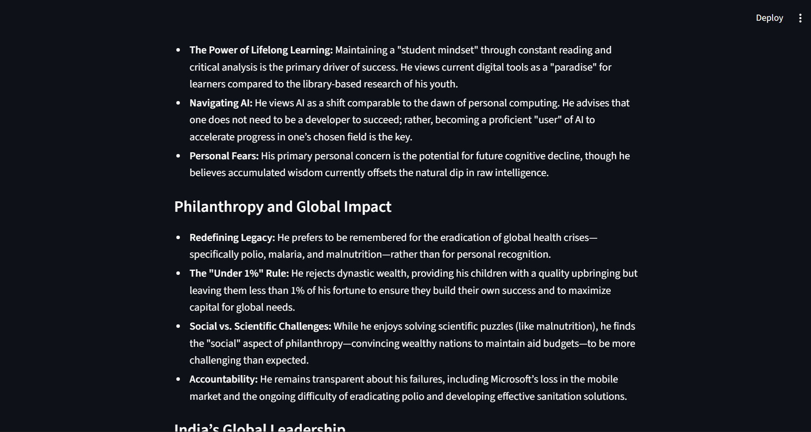
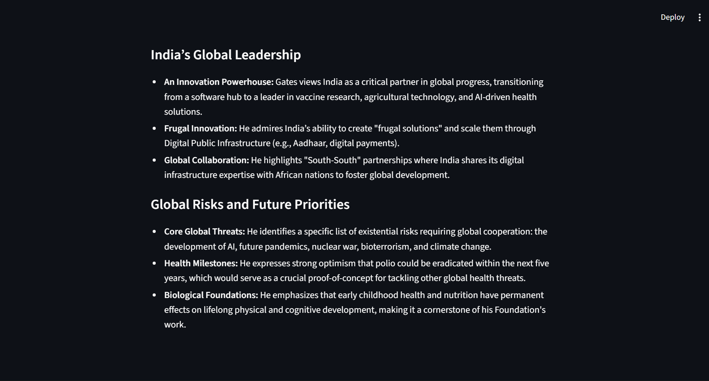

# AI YouTube Video Summarizer

An AI-powered YouTube Video Summarizer built using Python, FastAPI, Streamlit, and Google Gemini API.

The application allows users to paste a YouTube video link and generate intelligent AI summaries from the video transcript.

It supports:

* Short Summaries
* Detailed Notes
* Bullet Point Summaries
* Beginner-Friendly Explanations

The system also includes adaptive summarization logic for handling both short and long transcripts efficiently.

---

## Features

* AI-powered YouTube video summarization
* YouTube transcript extraction
* Multiple AI summary modes
* Adaptive summarization pipeline
* Automatic chunking for long videos
* Cost-optimized AI orchestration
* FastAPI backend architecture
* Streamlit frontend UI
* Loading spinner and polished UX
* Frontend and backend validation
* Error handling and graceful failures
* Dynamic prompt engineering
* Modular project structure

---

## Tech Stack

* Python
* FastAPI
* Streamlit
* Google Gemini API
* youtube-transcript-api
* Pydantic
* Requests
* python-dotenv
* Uvicorn

---

## Project Structure

```bash
AI-YouTube-Video-Summarizer/
│
├── backend/
│   ├── main.py
│   ├── summarizer.py
│   ├── transcript.py
│   ├── config.py
│   ├── requirements.txt
│   ├── .env
│
├── frontend/
│   ├── app.py
│
├── screenshots/
│
├── .gitignore
└── README.md
```

---

## Installation

### 1. Clone Repository

```bash
git clone https://github.com/decoded15/AI-YouTube-Video-Summarizer.git
cd AI-YouTube-Video-Summarizer
```

---

### 2. Create Virtual Environment

```bash
python -m venv venv
```

---

### 3. Activate Virtual Environment

#### Windows

```bash
venv\Scripts\activate
```

---

### 4. Install Dependencies

```bash
pip install -r requirements.txt
```

---

### 5. Add Gemini API Key

Create a `.env` file inside the backend folder:

```env
GEMINI_API_KEY=your_api_key_here
```

---

## Run The Backend

Move into backend folder:

```bash
cd backend
```

Run FastAPI server:

```bash
uvicorn main:app --reload
```

---

## Run The Frontend

Open another terminal.

Move into frontend folder:

```bash
cd frontend
```

Run Streamlit app:

```bash
streamlit run app.py
```

---

## Features Implemented Incrementally

* FastAPI backend setup
* API routing and validation
* YouTube transcript extraction
* Transcript preprocessing
* Gemini AI integration
* Dynamic prompt engineering
* Adaptive summarization pipeline
* Conditional chunking architecture
* Multiple summary modes
* Frontend-backend communication
* Streamlit frontend integration
* Loading spinner
* Frontend validation
* Backend exception handling
* Professional error responses
* UI refinement and markdown rendering

---

## AI Engineering Concepts Learned

This project helped in understanding:

* LLM APIs
* FastAPI fundamentals
* API request/response flow
* Pydantic validation
* External API integration
* Prompt Engineering
* Dynamic Prompt Orchestration
* Long-context AI workflows
* Token limitations
* Chunking strategies
* Map-Reduce summarization
* Adaptive AI pipelines
* Frontend-backend architecture
* Error handling
* UX refinement
* Cost optimization strategies
* AI workflow orchestration

---

## Adaptive Summarization Architecture

### Small Transcript

```text
Transcript
    ↓
Single Gemini Call
    ↓
Summary
```

### Large Transcript

```text
Transcript
    ↓
Chunking Pipeline
    ↓
Chunk Summaries
    ↓
Final Combined Summary
```

This adaptive architecture helps optimize:

* API cost
* latency
* scalability
* summarization quality

---

## Future Improvements

* Timestamp-based summaries
* Export summaries as PDF/Markdown
* Semantic chunking
* Multi-language summaries
* Video metadata extraction
* AI chat with video (RAG)
* Vector search over transcripts
* Summary history
* User authentication

---

## Screenshots

### Home Page



---

### Summary Modes



---

### Generated Summary




---

### Long Podcast Summary





---

## Author

Built by Dibyansh (decoded15)
